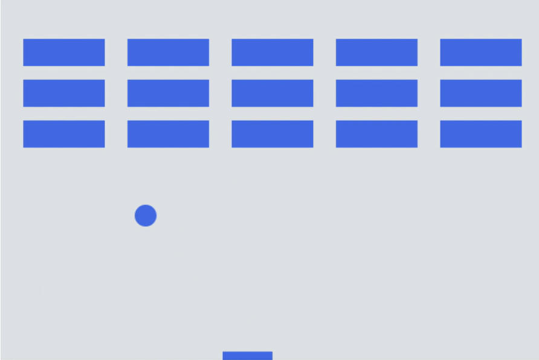
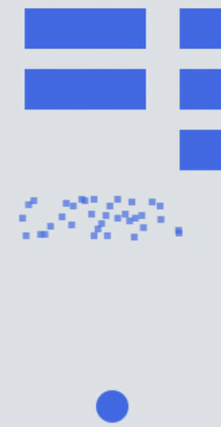

## 벽돌부수기 - Mdn Tutorial

### MDN 튜토리얼 프로젝트와의 차이

- `MDN` 프로젝트에서는 `클래스`를 이용하지 않았지만 본 프로젝트에서는 이용함.
- `아이디어`만 빌려온 후, 나머지는 `직접 구상 후` 코딩.
- `기능` 별로 `js`파일들을 나눔.

### 추가한 부분

- 벽돌이 깨졌을 시 나타나는 `brick particle system` 추가

### 최종결과

- 전체적인 모습

- brick particle system

